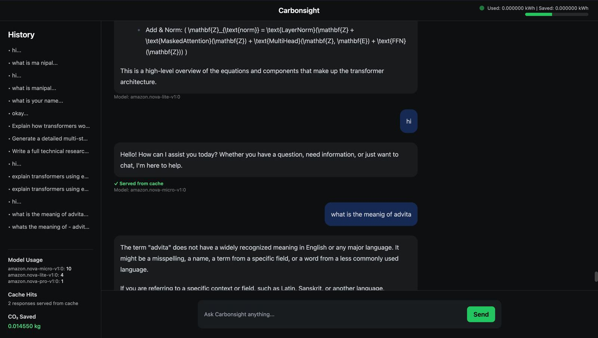
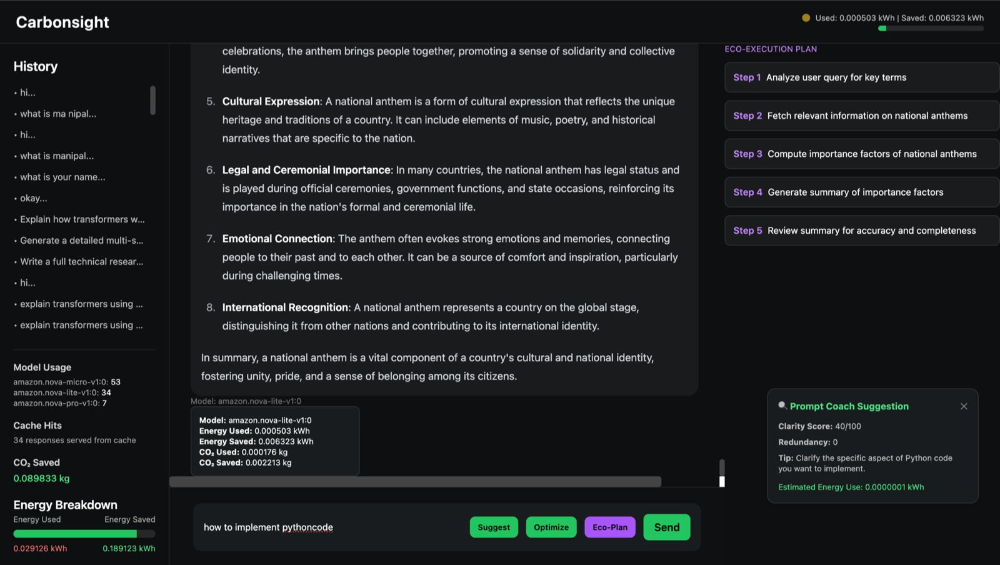
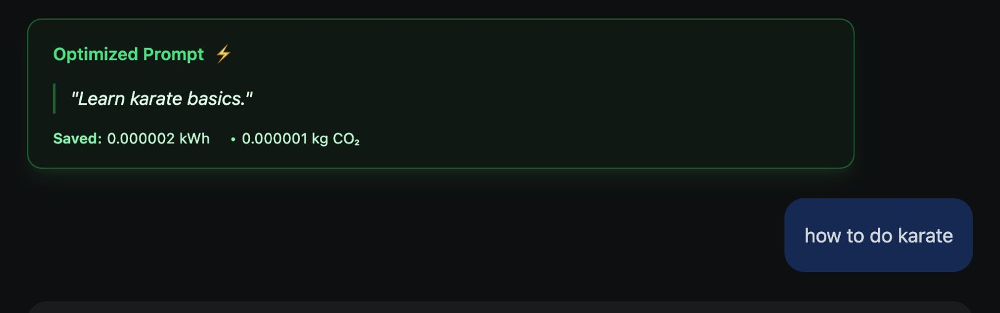
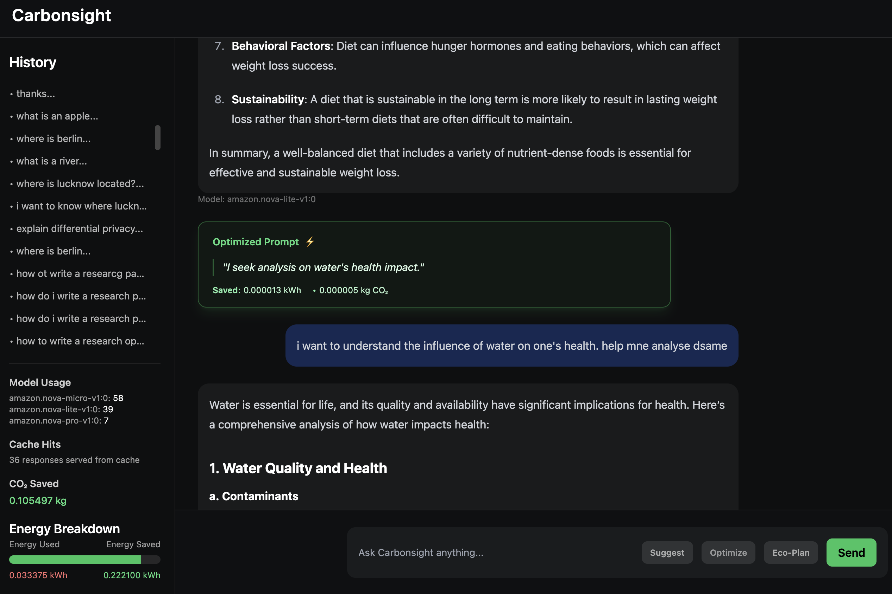

# Carbonsight  
**Carbon-Aware Agentic AI Platform built on AWS**

Carbonsight is an **enterprise-first generative AI orchestration platform** that makes AI usage **measurable, optimizable, and sustainable**.  

Prompting currently has been reduced to mere text inputs.

CarbonSight
- creates a prompt life cycle
- uses genAI to handle optimisation of the prompt's entire life cycle. 

This can be usedful for ESG reporting and carbon-credit mapping. 

It introduces carbon-aware routing, semantic caching, and agent-driven prompt intelligence to reduce the environmental cost of large language models without sacrificing user experience.

This project was built as part of an **AWS-sponsored Generative AI hackathon**, using Amazon Bedrock, AWS Lambda, DynamoDB, and a modern React frontend.

---

## Problem Statement

As generative AI adoption grows, its **energy consumption and carbon footprint remain largely invisible** to users and organizations. Most AI systems optimize for speed or cost, but not sustainability.

Carbonsight addresses this gap by making AI systems **carbon-aware by design**.

---

## Core Idea

Carbonsight helps developers and organizations:
- Measure the energy and CO₂ impact of AI usage
- Actively reduce carbon emissions through intelligent agents
- Visualize and incentivize sustainable AI behavior

---

## Tehcnological Tri-agentic Architecture 

1. Routing Agent
Classifies prompt complexity and selects the most carbon-efficient Amazon Nova model (Micro / Lite / Pro), along with a bounded token budget.

2. Embedding Agent
Generates semantic embeddings and checks DynamoDB for similar past prompts. Cache hits bypass inference entirely, resulting in near-zero energy usage.

3. Thinking Agent
Controls reasoning depth by allocating a strict thinking budget, preventing over-generation and unnecessary token consumption


## Key Features

### 1. Carbon-Aware Model Routing
Each request is dynamically routed to the **lowest-carbon viable model** based on task complexity.

- Micro → Lite → Pro model selection
- Token-aware and complexity-aware routing
- Prevents unnecessary use of high-carbon models

---

### 2. Semantic & Embedding-Based Caching
Carbonsight avoids redundant LLM calls by:

- Generating embeddings for incoming prompts
- Performing semantic similarity matching
- Serving cached responses when similarity exceeds a threshold

This directly saves compute, cost, and carbon emissions.

---

### 3. R-EcoWrite (Prompt Optimization Agent)
An agent that rewrites user prompts to be:

- Shorter
- Less redundant
- Semantically equivalent

The optimized prompt is used internally, while the user always sees their original input.  
Carbon savings are transparently displayed in the UI.

---

### 4. Prompt Coach (Pre-Send Guidance)
A lightweight agent that runs **before** a prompt is sent:

- Analyzes clarity and redundancy
- Estimates energy usage
- Suggests improvements without triggering an LLM call

This reduces wasted tokens and improves output quality.

---

### 5. Eco-Plan Agent (Structured Reasoning)
For medium and complex queries, Carbonsight can:

- Generate a step-by-step execution plan
- Display the plan to the user
- Inject the plan into the final LLM request

This improves reasoning quality, reduces hallucinations, and controls carbon usage.

---

### 6. Carbon Forecasting (Pluggable)
The system supports:

- Historical energy tracking
- Carbon usage forecasting
- Dashboard-level sustainability insights

A forecasting agent is included as an extensible module.

---

## Project Feature Gallery (UI screenshots)



---



---



---



---


## Reading the Carbonsight Interface

Carbonsight uses simple visual signals to make model choice, efficiency, and sustainability transparent. Every UI element reflects a real backend decision.

---

### Model Indicator (Top Bar)

The animated bubble shows which class of model powered the latest response:

- **Green** — Low-carbon execution  
  Cached responses, optimized prompts, or lightweight models (Nova Micro)

- **Yellow** — Medium complexity  
  Balanced reasoning with controlled cost (Nova Lite)

- **Red** — High complexity  
  Large models used only when required (Nova Pro)

Model selection is handled by the routing agent, not the frontend.

---

### Cached Responses

When a response is reused via semantic cache:
- A **“Served from cache”** label appears
- Energy and CO₂ usage are recorded as zero
- The indicator remains green

This avoids redundant inference and reduces carbon cost.

---

### R-EcoWrite (Prompt Optimization)

When **Optimize** is enabled:
- The user’s original prompt is preserved
- A green optimization chip shows the rewritten prompt and estimated savings
- Only the optimized prompt is sent to downstream agents

Optimization is transparent and auditable.

---

### Prompt Coach (Suggest Mode)

Prompt Coach is advisory only:
- No request is sent to `/ask`
- Users see clarity, redundancy, and energy estimates
- Helps refine prompts before spending tokens

---

### Eco-Plan (Execution Planning)

For complex queries:
1. A step-by-step plan is generated
2. Steps are shown in the side panel
3. The final response follows this plan

This improves accuracy and reduces hallucinations.

---

### Carbon Tooltips

Hovering over responses reveals:
- Model used
- Cache status
- Predicted vs actual energy and CO₂

---

### Design Philosophy

Carbonsight treats sustainability as a system constraint:
- Efficient behavior is visible
- Model usage is transparent
- Reuse is preferred over regeneration

---

## Architecture Overview

### Frontend
- React + Vite
- TailwindCSS
- Interactive chat interface
- Carbon visualizations and agent toggles

### Backend
- AWS Lambda (Python)
- Amazon Bedrock (Nova models)
- DynamoDB for semantic caching
- Agent-based orchestration layer

---

## Repository Structure

### Backend (`carbonsight-backend/`)

```text
bedrock_client.py        # Bedrock model & embedding invocation
carbon_agent.py          # Energy & CO₂ estimation
carbon_forecast_agent.py # Forecasting logic
coach_agent.py           # Prompt Coach agent
eco_rewrite_agent.py     # Prompt optimization (R-EcoWrite)
eco_plan_agent.py        # Execution plan generator
embedding_agent.py       # Embedding & similarity pipeline
routing_agent.py         # Complexity classification & model routing
thinking_agent.py        # Token budget allocation
dynamo_cache.py          # Semantic cache persistence
similarity.py            # Vector similarity utilities
lambda_function.py       # API router (/ask, /optimize, /coach, /plan)
utils.py                 # Shared helpers
Frontend (carbonsight-frontend/)
text
Copy code
src/
  components/
    CarbonTooltip.jsx
    OptimizedChip.jsx
    PromptSuggestor.jsx
    CarbonForecastPanel.jsx
    Navbar.jsx
    Sidebar.jsx
  App.jsx
public/
index.html
tailwind.config.js
vite.config.js
```

## Frontend Structure (`carbonsight-frontend/`)

```text
src/
  components/
    CarbonTooltip.jsx
    OptimizedChip.jsx
    PromptSuggestor.jsx
    CarbonForecastPanel.jsx
    Navbar.jsx
    Sidebar.jsx
  App.jsx
public/
index.html
tailwind.config.js
vite.config.js

public/
index.html

tailwind.config.js
vite.config.js
```

## API Endpoints


```text
/ask	Main AI response endpoint with routing, caching, and carbon tracking

/optimize	Prompt rewriting using R-EcoWrite

/coach	Prompt coaching and energy estimation

/plan	Eco-Plan generation for structured reasoning

/forecast	Carbon usage forecasting
```

## Running the Project Locally:

- Frontend

```text
cd carbonsight-frontend
npm install
npm run dev
```

- Backend

```text
Deployed on AWS Lambda
```


(Requires AWS credentials with Bedrock access enabled)


## Prompt Lifecycle (End-to-End Flow)

```text
User Input
   |
   |-- (Optional) Prompt Coach
   |       - Clarity analysis
   |       - Redundancy detection
   |       - Energy estimation
   |
   |-- (Optional) R-EcoWrite
   |       - Prompt rewritten to reduce tokens
   |       - Carbon savings computed
   |
   |-- (Optional) Eco-Plan
   |       - Step-by-step execution plan generated
   |       - Plan displayed to user
   |
   v
Semantic Embedding
   |
   |-- Similarity Check (DynamoDB)
   |       - Cache hit → return response
   |       - Cache miss → continue
   |
   v
Complexity Classification
   |
   |-- Model Routing
   |       - Micro / Lite / Pro (Nova models)
   |
   v
LLM Invocation (Amazon Bedrock)
   |
   |-- Energy + CO₂ Estimation
   |
   v
Response Returned
   |
   |-- Cache Stored
   |-- Metrics Visualized
```

## AWS Technology Stack

### Compute & Orchestration
  - AWS Lambda
    - Stateless agent orchestration
    - Scales automatically with usage

### Generative AI
  - Amazon Bedrock
    - **amazon.nova-micro-v1:0**: Classification, routing, prompt rewriting
    - **amazon.nova-lite-v1:0**: Standard responses, medium complexity
    - **amazon.nova-pro-v1:0**: Complex reasoning and long-form responses

### Storage & Caching
  - Amazon DynamoDB
    - Semantic cache for embeddings
    - Prevents redundant LLM calls
    - Reduces cost and carbon emissions

  - Intelligence & Agents
    - Embedding-based similarity search
    - Agent-driven orchestration
    - Carbon estimation heuristics

---

## Kiro Usage

Kiro was used as a **spec-first coordination layer** to structure Carbonsight’s multi-agent system and dashboards.

Instead of writing features directly in code, Kiro locked down **what each agent and dashboard is responsible for**, and then implemented against those specs.

---

### Specs — Feature-by-Feature, Not Theory

A separate Kiro spec for each major Carbonsight capability:

- **R-EcoWrite (Prompt Optimization)**
  - Defined when rewriting should trigger
  - Defined expected energy and CO₂ outputs
  - Prevented rewriting from changing user intent

- **Eco-Plan (Execution Planning)**
  - Defined when planning is allowed (medium/complex queries only)
  - Defined plan structure (ordered, bounded steps)
  - Ensured plans are shown to the user before execution

- **Prompt Coach**
  - Defined clarity scoring and feedback format
  - Defined UI-only behavior (no backend execution)
  - Defined energy estimation as advisory, not enforced

- **Model Routing**
  - Defined thresholds for Nova Micro / Lite / Pro
  - Defined fallback behavior during throttling
  - Defined sustainability-first routing rules

- **Dashboards (Upcoming)**
  - User-level efficiency score
  - Team-level aggregation and leaderboards
  - Admin-level ESG and usage analytics

Each spec produced:
- Concrete requirements (`WHEN X → SYSTEM SHALL Y`)
- A clear data flow (frontend → Lambda → Bedrock → cache)
- A task list that mapped directly to files and endpoints

This helped avoid feature overlap and agent conflicts as the system grew.

---

### Hooks — Keeping Agent Code Clean Under Pressure

Kiro hooks used mainly as **guardrails** during fast iteration:

- Checked new agent files for missing error handling
- Flagged inconsistent API response shapes
- Helped keep routing, caching, and carbon metrics aligned
- Reduced breakage when modifying Lambda handlers quickly

This mattered a lot once multiple agents were calling Bedrock in different ways.

---

### Steering — Enforcing Sustainability by Default

Steering was used to keep global behavior consistent:

- Prefer low-carbon models unless complexity demands otherwise
- Run optimization before planning or execution
- Prevent accidental overuse of Nova Pro
- Keep carbon accounting consistent across features

---

### Why Kiro Mattered Here

Kiro helped:
- Build multiple GenAI agents without losing control
- Keep prompt lifecycle and execution transparent
- Design dashboards in parallel with backend logic
- Maintain production discipline during a hackathon

---

## Why This Project Fits the Hackathon

- Built entirely on **AWS Generative AI infrastructure**
- Directly addresses **Climate & Sustainability**
- Demonstrates **agentic system design at scale**
- Goes beyond chat into:
  - Prompt optimization
  - Execution planning
  - Carbon observability
  - Responsible AI usage
- Designed from day one for **enterprise dashboards and ESG reporting**

---

## Future Extensions

- Organization-wide ESG reporting
- Model usage heatmaps
- Sustainability leaderboards
- SageMaker-based forecasting models
- Optional blockchain-backed sustainability credits

---

## Author

**Advita Shrivastava**  
AWS ImpactX – Generative AI Innovate & Build Challenge
